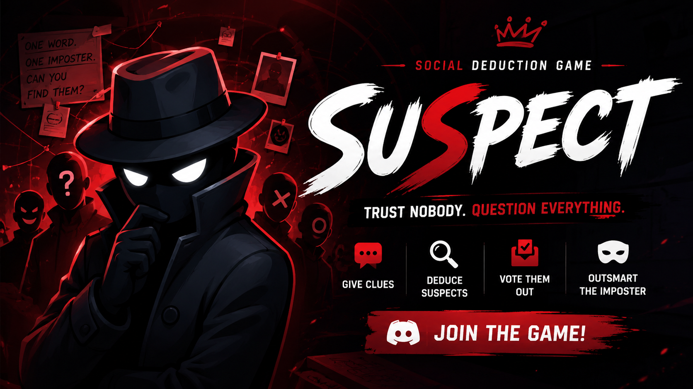

# 🎭 Suspect

A social deduction game for Discord where every clue matters, every vote counts, and anyone could be the Imposter.

## About

Suspect is a multiplayer Discord game built around deception, deduction, and communication. Players receive secret words and must determine who doesn't belong through clues, discussion, and voting.

Most players receive the same word, while one or more players receive a different word. The challenge is to identify the Imposter before they deceive the entire group.

Perfect for friend groups, gaming communities, events, and active Discord servers.

---

## Features

* Secret word social deduction gameplay
* Multiple game modes
* Interactive clue and voting phases
* Timed turns and automated game progression
* Hidden Mode for advanced gameplay
* Persistent player statistics
* Global leaderboards
* Duplicate clue prevention
* Word repeat prevention
* Supports both slash commands and prefix commands
* Designed for multiplayer communities

---

## How To Play

### 1. Join a Game

Players join the lobby and wait for enough participants.

### 2. Receive Your Word

Every player receives a secret word through direct messages.

Most players receive the same word.

One or more players may receive a different word.

### 3. Give Clues

Players take turns providing clues related to their word.

Use your clues carefully.

Reveal too much and you'll expose the word.

Reveal too little and you'll look suspicious.

### 4. Discuss

Analyze clues, identify inconsistencies, and determine who doesn't belong.

### 5. Vote

Vote for the player you believe is the Imposter.

If the crew identifies the Imposter, they win.

If the Imposter survives, they win.

---

## Commands

### Prefix Commands

```txt
=help
=enter
=leave
=start
=status
=leaderboard
=skip
=guess
```

### Slash Commands

```txt
/help
/enter
/leave
/start
/status
/leaderboard
/skip
/guess
```

---

## Game Modes

### Normal Mode

The Imposter knows they are different and must blend in while avoiding detection.

### Hidden Mode

The Imposter does not know they are different, creating a completely unique deduction experience.

---

## Statistics

Track your performance across every game:

* Games Played
* Games Won
* Crew Wins
* Imposter Wins
* Correct Votes
* Win Rate

Compete with other players and climb the leaderboard.

---

## Technology

Built with:

* Node.js
* Discord.js v14

---

## Links

* Invite Bot
* Support Server
* Website
* Terms of Service
* Privacy Policy

---

## Contributing

Suggestions, feedback, and feature requests are always welcome.

---

## License

This project is licensed under the MIT License.

---

Trust nobody.

Question everything.

Find the Imposter.
